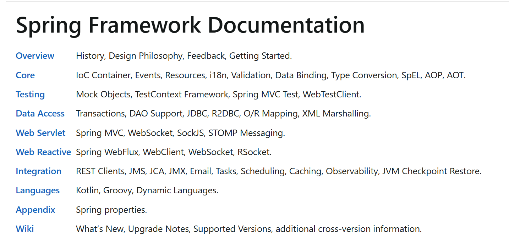
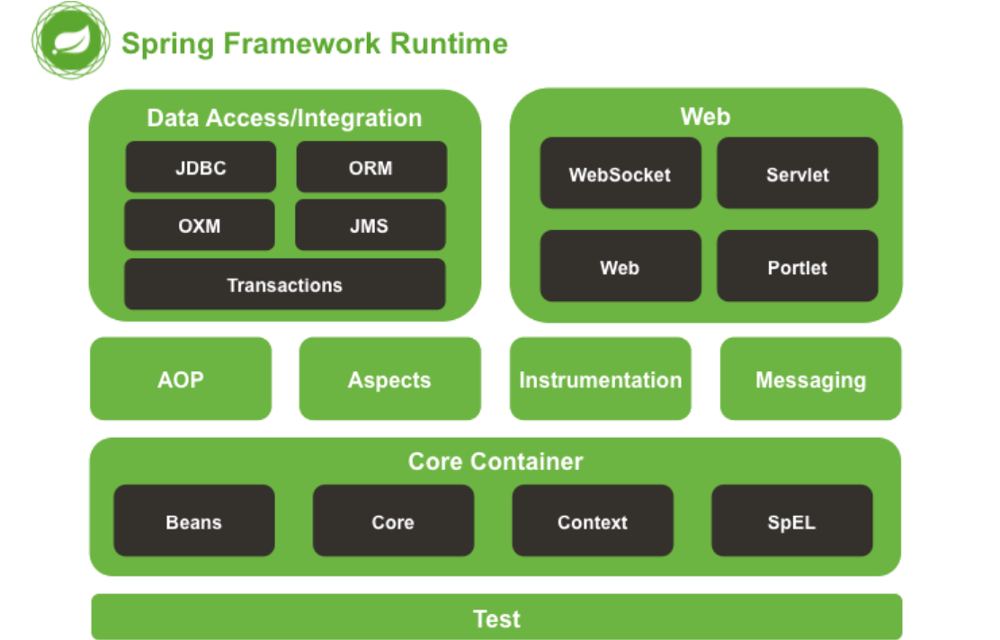
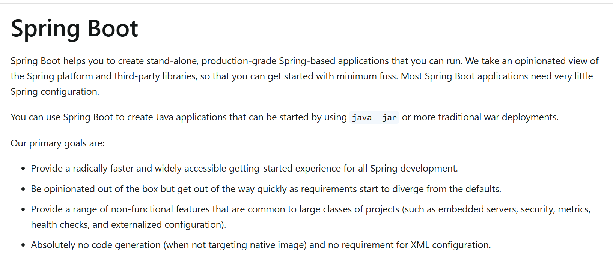
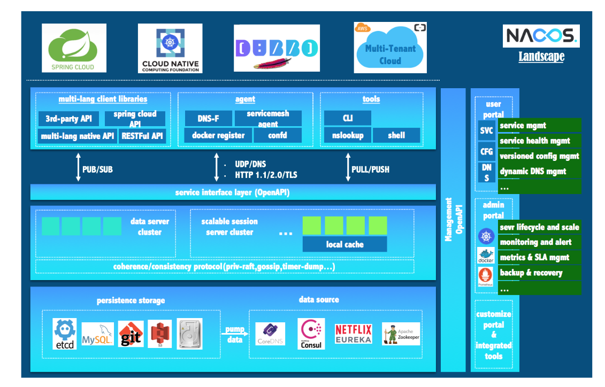

# Spring 全家桶

spring-ioc-aop-orm-mvc-cloud

---

## 学习路径

| 模块                   | 内容说明                                           |
| ---------------------- |------------------------------------------------|
| java-se                | Java 基础（IO、集合、线程、反射、注解、泛型等）                    |
| spring-ioc-by-xml      | Spring XML 配置方式（Bean、依赖注入、属性配置）                |
| spring-ioc-by-annotion | Spring 注解配置（@Bean、@Value、@Autowired、@Resource） |
| spring-ioc-by-factory  | Spring 工厂模式（FactoryBean、Bean 生命周期）             |
| spring-rebuild-ioc     | 手写简易 Spring IOC 容器                             |
| spring-rebuild-web     | 手写简易 Spring Web 容器                             |
| spring-security        | Spring Security（认证授权、JWT）                      |
| spring-transaction     | Spring 事务管理                                    |
| spring-aop             | Spring AOP（JDK 动态代理、CGLIB 代理）                  |
| spring-mvc             | Spring MVC（请求处理、JSON、文件上传下载、拦截器）               |
| spring-orm             | Spring orm（请求数据库，对象关系映射）                       |
| spring-boot            | Spring Boot 快速开发（自动配置、Web、AOP、Lombok）          |
| spring-cloud           | Spring Cloud 微服务（主要是nacos+gateway+负载均衡）        |

| 1                       | 2                  | 3                   |
| ----------------------- | ------------------- | ------------------- |
|  |  |  |

## spring

- **IOC**：控制反转，由 Spring 容器管理对象生命周期和依赖注入
- **AOP**：面向切面编程，通过代理实现横切关注点的统一处理
- **ORM**：对象关系映射
- **Spring Web**：基于Servlet实现MVC架构，负责接收HTTP请求、参数解析、控制器调度、视图/JSON响应.
- **Spring Boot**：约定优于配置，简化 Spring 应用开发
- **Spring Cloud**：微服务治理套件，提供服务发现、配置管理等能力（只对nacos+gateway+负载均衡学习和了解）

---

## dependency

- **JDK** 17

- **Spring Framework** 6+

- **Spring boot** 3.5.+

- **Spring cloud**  2025.+

  

  
